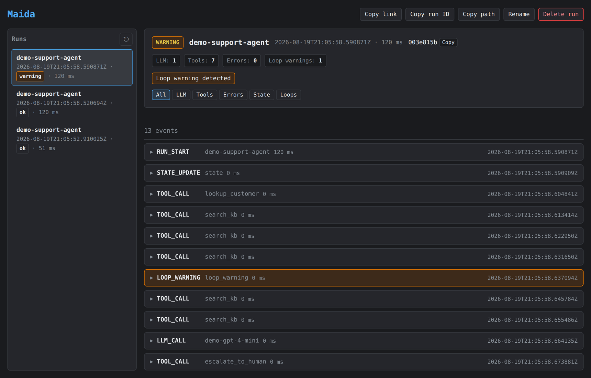

<div align="center">

# Maida

### Don't let broken agent changes merge.

[](https://pypi.org/project/maida-ai/)
[](https://pypi.org/project/maida-ai/)
[](https://github.com/maida-ai/maida/actions/workflows/unittest-fast.yml)
[](LICENSE)
[](https://maida.ai/docs/)



<sub><b>A real run, caught.</b> The agent returned a normal answer — and looped <code>search_kb</code> five times to get there.</sub>

</div>

---

Your agent still returns the right answer — but now it calls 3× the tools.
A retry loop that wasn't there last week. A new tool the baseline has never
seen. Output evals pass. Review sees a green diff. It ships.

**Maida is the pre-merge behavioral regression gate for AI agents.** It compares
agent execution traces against checked-in baselines and blocks PRs when
structural behavior regresses.

🔒 **No cloud. No accounts. No telemetry.** Everything stays on your machine, or
on your CI runner.

## ⚡ Try it in 60 seconds

No repo clone, no config file, no API key, no sign-up:

```bash
pip install maida-ai     # or: uv tool install "maida-ai>=0.5"
maida demo
maida view
```

`maida demo` runs a bundled, simulated customer-support agent — tool calls, LLM
calls, state updates, automatic secret redaction, all canned data. `maida view`
opens the timeline at `http://127.0.0.1:8712` with every event, input, output,
and timing. Leave it running: new runs appear in the sidebar as you go.

## 🎬 Watch it catch a regression

One command tells the whole story:

```bash
maida demo --regression
```

Maida baselines a known-good run, then runs a "refactored" agent that swaps in a
cheaper model, loops on a tool, calls a tool the baseline has never seen, and
burns 5× the tokens — **while still exiting with status `ok`.**

```
── Step 3/3 · Gate the new run against the baseline
   policy: no new tools, no loops, status ok, and cost near baseline

  ✗ step_count   [step_count_exceeded]     11 steps (baseline: 6, tolerance: 50%)
  ✗ tool_calls   [tool_call_count_exceeded] 7 tool calls (baseline: 3, tolerance: 50%)
  ✗ new_tools    [new_tool_path]           unexpected tools used: ['escalate_to_human']
  ✗ no_loops     [loop_detected]           repeated_call x3: TOOL_CALL:search_kb
  ✗ cost_tokens  [cost_envelope_exceeded]  447 tokens (baseline: 90, tolerance: 50%)
  ✓ duration     [no_regression]           120 ms (baseline: 120, tolerance: 500%)
  ✓ expect_status[no_regression]           status is 'ok'

RESULT: FAILED (5 of 7 active checks failed)
```

<details>
<summary><b>And the PR comment your team would see in CI</b></summary>

<br>

```markdown
## ❌ Maida verdict: fail

**5 of 7 checks failed** · run `40ced8d7` vs baseline `9612a7b6`

### Top behavior changes

| Behavior | Baseline | Current | Change |
|---|---|---|---|
| Steps | 6 | 11 | +83% |
| Loops/cycles | 0 | 1 | NEW |
| Cost envelope | 90 tokens | 447 tokens | +397% |
| Tool calls | 3 | 7 | +133% |

**Tool changes:**
- ➕ `escalate_to_human` — new tool, not in baseline
- ➖ `send_reply` — no longer called
- 🔁 `search_kb` — repeated 1 -> 5 calls
```

The report leads with the verdict, groups failures by stable reason code, and
ends with the exact commands to inspect or accept the change. Reruns update the
same comment in place.

</details>

<!-- MEDIA PLACEHOLDER: a ~20s screen recording of `maida demo --regression`
     belongs here, replacing the static terminal block above. Spec and the
     rest of the recording backlog live in repo-hygene-run/00-OWNER-REQUEST.md.
     Do not restore the old docs/assets/*.gif files -- they still show the
     pre-rename "AgentDbg" branding. -->

## 🧩 How it works

| | Step | Command |
|---|---|---|
| 1️⃣ | Instrument one agent entrypoint | `@trace` |
| 2️⃣ | Capture known-good trials | `maida run --no-fail-fast --json-out ...` |
| 3️⃣ | Check in a reviewed baseline | `maida baseline --from-report ...` |
| 4️⃣ | Declare acceptable behavior | `.maida/policy.yaml` |
| 5️⃣ | Gate every PR | `maida run --baseline ...` |
| 6️⃣ | Accept intentional changes, on purpose | `maida accept --reason "..."` |

Maida compares **structural behavior**, not answer text: step counts, tool-call
counts, tool paths, loop and cycle signatures, guardrail events, stop
conditions, and latency/cost envelopes.

> Evals ask *"was the answer good?"* Maida asks *"did this PR change how the
> agent behaves?"*

## 🔧 Instrument your own agent

Three lines in any Python agent:

```python
from maida import trace, record_llm_call, record_tool_call


@trace
def run_agent():
    # ... your existing agent code ...

    record_tool_call(
        name="search_db",
        args={"query": "active users"},
        result={"count": 42},
    )

    record_llm_call(
        model="gpt-4",
        prompt="Summarize the search results.",
        response="There are 42 active users.",
        usage={"prompt_tokens": 12, "completion_tokens": 8, "total_tokens": 20},
    )
```

Then scaffold the policy and workflow for a real project:

```bash
maida init            # writes a starter .maida/policy.yaml
maida init --github   # also writes .github/workflows/maida.yml
```

📖 [SDK reference](https://maida.ai/docs/sdk/) ·
[Getting started](https://maida.ai/docs/getting-started/) ·
[Policy reference](https://maida.ai/docs/reference/policy/)

### Gate it locally

```bash
# Sample known-good behavior across isolated trials
maida run my_agent.py --trials 25 --no-fail-fast --json-out baseline-report.json
maida baseline --from-report baseline-report.json --out baselines/my_agent.json

# After your next change, gate the candidate against that baseline
maida run my_agent.py \
  --baseline baselines/my_agent.json \
  --policy .maida/policy.yaml \
  --format markdown
```

### 🚧 Stop runaway runs while you iterate

Guardrails are opt-in development-time safety rails. They abort a run that
starts looping or blows past your budget — and still write a normal trace you
can inspect afterwards.

```python
@trace(
    stop_on_loop=True,
    max_llm_calls=10,
    max_tool_calls=20,
    max_duration_s=30,
)
def run_agent(): ...
```

Set them in `@trace(...)`, `.maida/config.yaml`, or env vars like
`MAIDA_MAX_LLM_CALLS=50`.
📖 [Guardrails guide](https://maida.ai/docs/guardrails/)

## 🚦 Gate your pull requests

The [`maida-assert`](https://github.com/maida-ai/maida-assert) Action wraps the
same CLI:

```yaml
- uses: maida-ai/maida-assert@v5
  with:
    agent-script: my_agent.py
    baseline: .maida/baselines/my_agent.json
    policy: .maida/policy.yaml
```

Exit code `0` = pass or inconclusive, `1` = fail. Reports come in text, JSON, or
Markdown.

📖 [Regression testing guide](https://maida.ai/docs/regression-testing/) ·
[CLI reference](https://maida.ai/docs/cli/)

### 🧭 Refuse a generated plan before it runs

If your agent builds its plan at runtime, the optional `maida-workflows`
backend resolves planner output against application-owned module contracts and
refuses a policy-breaking plan before any generated module executes:

```bash
uv tool install --force --python 3.12 --with "maida-workflows>=0.1.0" "maida-ai>=0.5.2.post1"
maida demo --plan
```

Core Maida and its ordinary demos keep working without the backend installed.

## 🔌 Integrations

Maida is framework-agnostic at its core — the SDK works with any Python code.
Adapters are optional and import-to-enable; the core package works without any
of them installed.

| Integration | Install | Guide |
|---|---|---|
| 🦜 LangChain / LangGraph | `maida-ai[langchain]` | [Guide](https://maida.ai/docs/integrations/langchain-langgraph/) |
| 🤖 OpenAI Agents SDK | `maida-ai[openai]` | [Guide](https://maida.ai/docs/integrations/openai-agents/) |
| 🛶 CrewAI | `maida-ai[crewai]` | [Guide](https://maida.ai/docs/integrations/crewai/) |
| 📊 Langfuse import | built in | [Guide](https://maida.ai/docs/langfuse/) |
| 🖥️ Claude Code capture | built in | [Guide](https://maida.ai/docs/claude-code/) |
| 🧾 Any emitter (no SDK) | built in | [Emitter guide](https://maida.ai/docs/reference/trace-emitter/) |

Systems that write native traces directly can check them with
`maida validate-trace` before handing them to the gate — no SDK required.

> **Langfuse tells you what happened; Maida tells you whether it changed.**

## 📚 Documentation

Full documentation lives at **[maida.ai/docs](https://maida.ai/docs/)**.

| | |
|---|---|
| 🚀 [Getting started](https://maida.ai/docs/getting-started/) | Install, first trace, first baseline |
| 🛡️ [Regression testing](https://maida.ai/docs/regression-testing/) | The end-to-end gate workflow |
| ⌨️ [CLI reference](https://maida.ai/docs/cli/) | Every command, option, and exit code |
| 🐍 [SDK reference](https://maida.ai/docs/sdk/) | `@trace`, recorders, contexts |
| 📜 [Policy reference](https://maida.ai/docs/reference/policy/) | `.maida/policy.yaml`, policy v2 |
| 🚧 [Guardrails](https://maida.ai/docs/guardrails/) | Stop runaway runs mid-flight |
| 🔍 [Viewer](https://maida.ai/docs/viewer/) | The local timeline UI |
| 🗄️ [Trace format](https://maida.ai/docs/reference/trace-format/) | The versioned data contract |
| ⚙️ [Configuration](https://maida.ai/docs/reference/config/) | Env vars, YAML precedence, redaction |
| 🏗️ [Architecture](https://maida.ai/docs/architecture/) | Schema, storage, loop detection |

Step-by-step notebooks live in
[maida-ai/maida-tutorials](https://github.com/maida-ai/maida-tutorials) — all
runnable without API keys.

## 🔒 Privacy and local-first guarantees

Redaction is **on by default**: values for keys matching `api_key`, `token`,
`authorization`, `cookie`, `secret`, and `password` are scrubbed before
anything is written to disk, and large fields are truncated.

Runs are plain files you can inspect or delete:

```
~/.maida/runs/<trace_id>/
├── meta.json     # run metadata (status, counts, timing)
└── spans.jsonl   # append-only OpenTelemetry span records
```

No prompt, response, tool payload, secret, or environment variable leaves your
machine or CI runner unless you explicitly configure it. Set `MAIDA_DATA_DIR` to
move storage elsewhere.

📖 [Configuration reference](https://maida.ai/docs/reference/config/)

## 🧪 Development

```bash
git clone https://github.com/maida-ai/maida.git
cd maida
uv venv && uv sync && uv pip install -e .
uv run pytest
```

<details>
<summary>No uv? Use pip instead.</summary>

```bash
python -m venv .venv && source .venv/bin/activate
pip install -e .
pytest
```

</details>

Contributions welcome — see [CONTRIBUTING.md](CONTRIBUTING.md) and
[SECURITY.md](SECURITY.md).

## 📄 License

Apache License 2.0. See [LICENSE](LICENSE).

---

<div align="center">
<sub>If Maida catches a regression for you, a ⭐ helps other teams find it.</sub>
</div>
