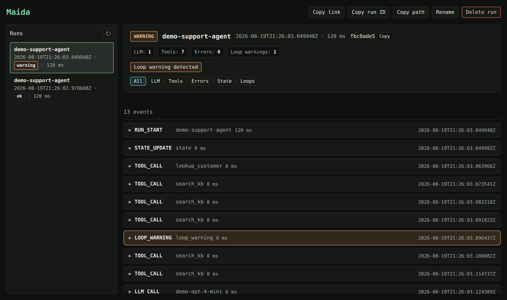

<div align="center">

# Maida

### Don't let broken agent changes merge.

[](https://pypi.org/project/maida-ai/)
[](https://pypi.org/project/maida-ai/)
[](https://github.com/maida-ai/maida/actions/workflows/unittest-fast.yml)
[](LICENSE)
[](https://maida.ai/docs/)



<sub><b>A real run, caught.</b> The agent returned a normal answer -- and looped <code>search_kb</code> five times to get there.</sub>

</div>

---

Your agent still returns the right answer -- but now it calls 3x the tools.
A retry loop that wasn't there last week. A new tool the baseline has never
seen. Output evals pass. Review sees a green diff. It ships.

**Maida is the pre-merge behavioral regression gate for AI agents.** It compares
agent execution traces against checked-in baselines and blocks PRs when
structural behavior regresses.

🔒 **No cloud or account required. No usage collection by default.** Traces stay
on your machine or CI runner. [Optional usage counts](docs/usage-ping.md) require
explicit consent and a configured collector; no collector is configured by default.

## Start with one useful check

Use Python 3.12–3.14. Install the standalone CLI, then run setup inside your Git repository:

```bash
uv tool install maida-ai
maida init
```

Automatic capture setup and `maida check` are new after shipped v0.6.0. These instructions require an installation whose `maida init --help` includes `--agent` and which provides `maida check`; until that release is published, use a wheel built from this checkout. See the [changelog](CHANGELOG.md) for released behavior.

Maida detects Claude Code, previews the passive hooks and local setup, and asks for one approval. Existing settings and other hooks are preserved. Start plain `claude` in this repository, run one bounded task such as finding its test command, then exit the session and run:

```bash
maida check
```

The report checks your own task's observed completion, loops and guardrail events, and prints the exact `maida view TRACE_ID` command to inspect that task. No policy, baseline, tutorial clone or telemetry receiver setup is required. Task evidence stays outside Git in a repository-specific directory under `~/.maida/projects/`; this is not telemetry sent to Maida. Capture follows your configured redaction settings and observes tool activity and lifecycle, not complete model-call, token or latency coverage. Your agent's normal provider use has its usual permissions and costs.

If Maida is installed in your project environment, use `uv run maida init` and `uv run maida check`. Hooks are bound to that environment and validated before setup reports ready; plain `claude` can run them without a global Maida command. The printed viewer command keeps the `uv run` prefix.

Setup uses local Claude settings and preserves shared team configuration and existing SDK/Python commands. The first check above selects this repository's captured task automatically; ordinary commands and baseline gates keep their existing run selection. To stop capturing, run `maida detach --agent claude-code`: it previews removal and asks once, keeping other hooks and saved evidence. Reconnect with `maida init --agent claude-code`.

**[Protect one coding-agent task →](https://maida.ai/docs/getting-started/)**

The setup target is under five minutes for one bounded task; it is not a measured activation claim. Review a small baseline and policy when the first report is useful; deliberate failure, repair and CI come later. Unsupported or ambiguous environments are explained before configuration changes.

For an offline rehearsal with the currently shipped release, use `uv tool install "maida-ai==0.6.0"`, then `maida demo --regression`: expect a FAIL verdict and PR-comment preview on canned data. No clone or API keys are needed. The demo exits `0` after showing the failing gate; an actual failed check exits `1`.

Building a Python tool-calling agent? Use the secondary [Python walkthrough](docs/python-agent.md), including installation into the project environment.

## What the gate checks

Maida compares the observed execution against your checked-in policy and baseline: tool use, loops, stop conditions, structural counts, and configured cost or latency limits. It does not establish answer correctness or behavior outside the captured evidence. Keep your correctness tests alongside it.

Read the verdict: **PASS**, **FAIL**, or **INCONCLUSIVE**. Exit `0` includes INCONCLUSIVE; consumers must not treat process success as approval.

## Investigate a failed check

Use `maida view` to inspect the local timeline and `maida diff --baseline .maida/baselines/agent.json` to understand the structural change. Repair an unintended regression; review the evidence and reason before accepting an intentional baseline change.

## Add the PR gate

After the local pass → deliberate failure → repair loop works, follow the [Action setup and protection requirements](https://github.com/maida-ai/maida-assert#blocking-mode-and-required-repository-settings). Use the [init reference](docs/cli/init.md) for your installed version. The workflow needs a real entrypoint, dependencies, a reviewed baseline, and an immutable Action pin.

A generated workflow is setup, not evidence of merge enforcement. Verify required checks on the actual PR head, trusted base policy, workflow protection, and the fresh result after acceptance before relying on that boundary.

## 🔌 Integrations

Maida is framework-agnostic at its core -- the SDK works with any Python code.
Adapters are optional and import-to-enable; the core package works without any
of them installed.

| Integration | Install | Guide |
|---|---|---|
| 🦜 LangChain / LangGraph | `maida-ai[langchain]` | [Guide](https://maida.ai/docs/integrations/langchain-langgraph/) |
| 🤖 OpenAI Agents SDK | `maida-ai[openai]` | [Guide](https://maida.ai/docs/integrations/openai-agents/) |
| 🛶 CrewAI | unsupported after v0.5.3 | [Guide](https://maida.ai/docs/integrations/crewai/) |
| 📊 Langfuse import | built in | [Guide](https://maida.ai/docs/langfuse/) |
| 🖥️ Claude Code capture | built in | [Guide](https://maida.ai/docs/claude-code/) |
| 🧾 Any emitter (no SDK) | built in | [Emitter guide](https://maida.ai/docs/reference/trace-emitter/) |

Systems that write native traces directly can check them with
`maida validate-trace` before handing them to the gate -- no SDK required.

> **Langfuse tells you what happened; Maida tells you whether it changed.**

## 📚 Documentation

Full documentation lives at **[maida.ai/docs](https://maida.ai/docs/)**.

| | |
|---|---|
| 🚀 [Getting started](https://maida.ai/docs/getting-started/) | Install, first trace, first baseline |
| 🛡️ [Regression testing](https://maida.ai/docs/regression-testing/) | The end-to-end gate workflow |
| ⌨️ [CLI reference](https://maida.ai/docs/cli/) | Every command, option, and exit code |
| 🐍 [SDK reference](https://maida.ai/docs/sdk/) | `@trace`, recorders, contexts |
| 📜 [Policy reference](https://maida.ai/docs/reference/policy/) | `.maida/policy.yaml`, policy v2 |
| 🚧 [Guardrails](https://maida.ai/docs/guardrails/) | Stop runaway runs mid-flight |
| 🔍 [Viewer](https://maida.ai/docs/viewer/) | The local timeline UI |
| 🗄️ [Trace format](https://maida.ai/docs/reference/trace-format/) | The versioned data contract |
| ⚙️ [Configuration](https://maida.ai/docs/reference/config/) | Env vars, YAML precedence, redaction |
| 🏗️ [Architecture](https://maida.ai/docs/architecture/) | Schema, storage, loop detection |

Step-by-step notebooks live in
[maida-ai/maida-tutorials](https://github.com/maida-ai/maida-tutorials) -- all
runnable without API keys.

## 🔒 Privacy and local-first guarantees

Redaction is **on by default**: values for keys matching `api_key`, `token`,
`authorization`, `cookie`, `secret`, and `password` are scrubbed before
anything is written to disk, and large fields are truncated.

Runs are plain files you can inspect or delete:

```
~/.maida/runs/<trace_id>/
├── meta.json     # run metadata (status, counts, timing)
└── spans.jsonl   # append-only OpenTelemetry span records
```

No prompt, response, tool payload, secret, or environment variable leaves your
machine or CI runner unless you explicitly configure it. Set `MAIDA_DATA_DIR` to
move storage elsewhere.

📖 [Configuration reference](https://maida.ai/docs/reference/config/)

## 🧪 Development

```bash
git clone https://github.com/maida-ai/maida.git
cd maida
uv venv && uv sync && uv pip install -e .
uv run pytest
```

<details>
<summary>No uv? Use pip instead.</summary>

```bash
python -m venv .venv && source .venv/bin/activate
pip install -e .
pytest
```

</details>

Contributions welcome -- see [CONTRIBUTING.md](CONTRIBUTING.md) and
[SECURITY.md](SECURITY.md).

## 📄 License

Apache License 2.0. See [LICENSE](LICENSE).

---

<div align="center">
<sub>If Maida catches a regression for you, a ⭐ helps other teams find it.</sub>
</div>
