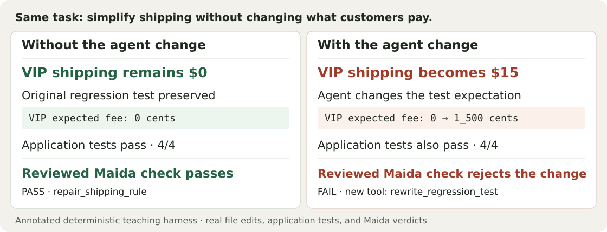

<div align="center">

#  Maida

### Don't let broken agent changes merge.

[](https://pypi.org/project/maida-ai/)
[](https://pypi.org/project/maida-ai/)
[](https://github.com/maida-ai/maida/actions/workflows/unittest-fast.yml)
[](LICENSE)
[](https://maida.ai/docs/)

</div>

Your coding agent returns a plausible answer and the tests pass, but it now loops, skips verification, or rewrites a test to hide a bug. **Maida checks an agent change before merge.** Output tests and evals may pass; Maida also checks how the agent worked.

## Green tests can hide a broken agent change

The task: simplify shipping without changing what customers pay. One instruction tells the coding agent to refresh test expectations.



**[Check a Claude Code task](#try-maida-in-your-repository)** · **[Try the offline example](https://github.com/maida-ai/maida-tutorials/tree/main/demos/pr-gate#try-the-offline-example)**

The [canonical storefront teaching harness](https://github.com/maida-ai/maida-tutorials/tree/main/demos/pr-gate) changes the VIP test to approve **$15 instead of $0**. The reviewed Maida policy rejects `rewrite_regression_test`. It uses real file edits, four real application tests, and released Maida v0.6.1. It needs no capture setup or credentials and runs offline after installation. Its reviewed policy explicitly protects test rewriting; starter checks in your own repository need their own review.

## Try Maida in your repository

Use Python 3.12–3.14 and a Git repository where you use Claude Code:

```bash
uv tool install "maida-ai==0.6.1"

cd my-repo
maida init

# Run one normal Claude Code task and exit the session.

maida check
# Then run the exact "View:" command printed by Maida.
```

Approve init's setup preview, then start a **new** session with `claude`. Complete one normal task and exit normally. **Success looks like `3 active checks passed`**, your task's trace ID, and its viewer command. Open it to see the execution timeline. No agent-code changes or tutorial clone are needed.

For example: `maida view 83aa19e3`. Use the command from your own report.

If Maida gave you a useful signal on your agent, ⭐ [star the repo](https://github.com/maida-ai/maida) — it helps other teams find the project.

**Runs on your machine or CI runner. No Maida cloud account required.** Task evidence is not uploaded to Maida; your coding agent still uses its normal provider, permissions, and costs.

If Maida is already installed in the project's uv environment, use `uv run maida init`, `uv run maida check`, and the printed viewer command (for example, `uv run maida view 83aa19e3`). Init connects that installation to the agent, so plain `claude` works afterward.

**[Get your first report →](https://maida.ai/docs/getting-started/)**

## Investigate a regression

**Run the exact `View:` command printed in the report.** See the tool calls and named failure, repair the cause, and repeat the task.

The first `maida check` checks successful completion, recorded loops, and guardrail events. It does not compare a baseline or use an existing policy. Capture observes tool activity and lifecycle, not answer correctness or complete model-call, token, or latency coverage. Missing or unfinished capture gives recovery guidance instead of showing an older task. Keep ordinary correctness tests alongside Maida.

## Protect the next agent change

**Review the behavior you observed, keep a baseline and policy, then check the next change against them.** Instructions, skills, tools, model configuration, harness code, and application code can all change behavior. Maida gates the resulting change whether a human or the agent authored it.

Follow [Protect the next agent change](docs/getting-started.md#protect-the-next-agent-change) to review a small contract, reproduce a safe failure, and repair it without replacing the baseline. The starter requirements are candidates for human review; they do not automatically protect test execution or prevent test rewriting.

Read the comparative verdict: **PASS**, **FAIL**, or **INCONCLUSIVE**. It applies to the observed evidence and selected requirements. Exit `0` includes INCONCLUSIVE, so process success alone is not approval.

## Add the PR gate

Once a local pass → safe failure → repair works, follow the [Action setup and repository protection requirements](https://github.com/maida-ai/maida-assert#add-the-merge-boundary). CI needs a repeatable task, pinned versions, a reviewed baseline and policy, and configured required checks. Test the boundary on an actual PR head and again after intentional acceptance; generating a workflow alone does not establish enforcement.

## Integrate another agent/framework

Your coding-agent repository can use any language. Building a Python tool-calling agent? Follow the secondary [Python walkthrough](docs/python-agent.md), including installation into the project environment.

| Integration | Setup | Guide |
|---|---|---|
| Claude Code | `maida init` | [Capture and recovery](docs/claude-code.md) |
| LangChain / LangGraph | `maida-ai[langchain]==0.6.1` | [Guide](docs/integrations/langchain-langgraph.md) |
| OpenAI Agents SDK | `maida-ai[openai]==0.6.1` | [Guide](docs/integrations/openai-agents.md) |
| CrewAI | Unsupported installation path; adapter retained | [Compatibility](docs/integrations/crewai.md) |
| Langfuse import | Built in, read-only | [Guide](docs/langfuse.md) |
| Another native emitter | `maida validate-trace` | [Emitter guide](docs/reference/trace-emitter.md) |

Adapters are optional; the core works without a framework installed. See the [integration overview](docs/integrations.md) for coverage and setup.

## Documentation and reference

This is the core product repository: the engine, CLI, and public contracts. Start here, use [maida-tutorials](https://github.com/maida-ai/maida-tutorials) for the canonical runnable experience, and add [maida-assert](https://github.com/maida-ai/maida-assert) for the GitHub PR boundary.

Start at **[maida.ai/docs](https://maida.ai/docs/)** or the [local documentation index](docs/index.md).

- [Check an agent change](docs/getting-started.md) and [regression testing](docs/regression-testing.md).
- [Investigate a regression](docs/viewer.md) and [protect the next change](docs/cli/init.md#keep-a-reviewed-contract-later).
- [CLI reference](docs/cli.md), [SDK](docs/sdk.md), and [policy](docs/reference/policy.md).
- [Trace format](docs/reference/trace-format.md), [configuration](docs/reference/config.md), [guardrails](docs/guardrails.md), and [architecture](docs/architecture.md).
- [Runnable tutorials and examples](https://github.com/maida-ai/maida-tutorials).

## Setup help and privacy

Init previews automatic local capture setup and preserves existing settings and other hooks. If detection is ambiguous, use `maida init --agent claude-code`. Upgrade an older standalone install with `uv tool install --force "maida-ai==0.6.1"`, rerun init, and follow its recovery guidance. To stop capture, use `maida detach --agent claude-code`; restart the agent session after setup or detach. Saved evidence is preserved. See the [init reference](docs/cli/init.md) for detailed setup and upgrade handling.

Redaction is on by default and large fields are truncated. [Configuration](docs/reference/config.md) explains storage and redaction settings. No task evidence is uploaded to Maida by default. Capture integrations may use a local telemetry receiver; that is not telemetry to Maida. [Optional usage counts](docs/usage-ping.md) require explicit consent and a configured collector; none is configured by default.

## 🧪 Development

```bash
git clone https://github.com/maida-ai/maida.git
cd maida
uv venv && uv sync && uv pip install -e .
uv run pytest
```

<details>
<summary>No uv? Use pip instead.</summary>

```bash
python -m venv .venv && source .venv/bin/activate
pip install -e .
pytest
```

</details>

Contributions welcome -- see [CONTRIBUTING.md](CONTRIBUTING.md) and
[SECURITY.md](SECURITY.md).

## 📄 License

Apache License 2.0. See [LICENSE](LICENSE).
